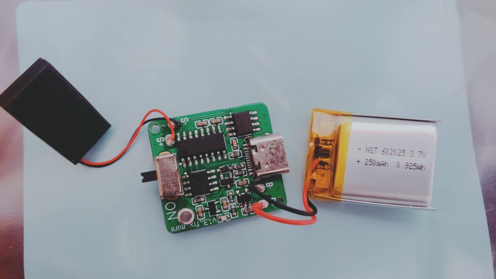

# LuckyGift

If you're struggling to find the perfect gift, consider this one with the appearance of a gift-wrapped present.

It is a random sound player that supports the replacement of MP3 audio files via USB transfer. Whether it's a warm greeting, a classic movie clip, or some spine-chilling sound effects, it can handle any audio you desire, offering an infinite range of auditory experiences. It's not just a gift; it's a conveyance of creativity and surprise.

https://github.com/user-attachments/assets/6f7e7c94-927f-46ea-9b2e-1a37740b2967

## HARDWARE

**Gerber**: [Here](https://www.elecrow.com/sharepj/luckygift-a-real-gift-504.html)

#### Specification

- MCU: CH32V003J4M6
- Speaker
- 3.7V Lithium battery, 250mAh, 602025
- Power switch
- Lithium battery charging circuit
- Vibration switch
- USB Type-C interface

## 3D PRINTING

- [MakerOnline](https://www.makeronline.com/en/model/LcukyGift%20-%20a%20real%20gift/134579.html)
- [MakerWorld](https://makerworld.com/zh/models/917329#profileId-878876)

## FIRMWARE

The program is developed using MounRiver Studio, which enables direct compilation and downloading of code onto WCH microcontrollers.

